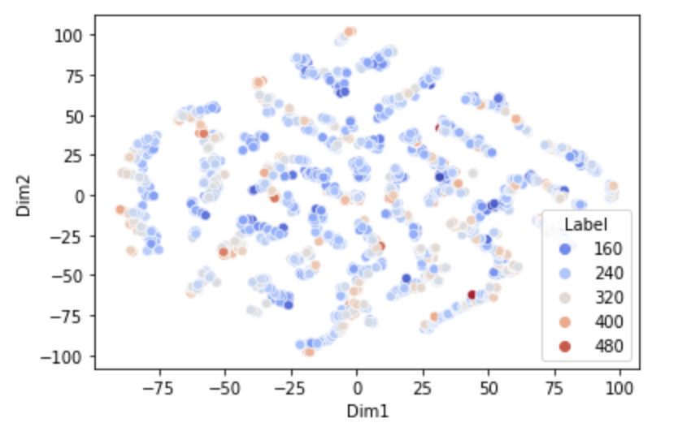
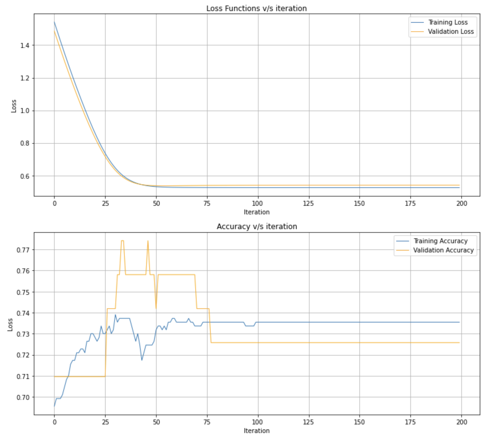
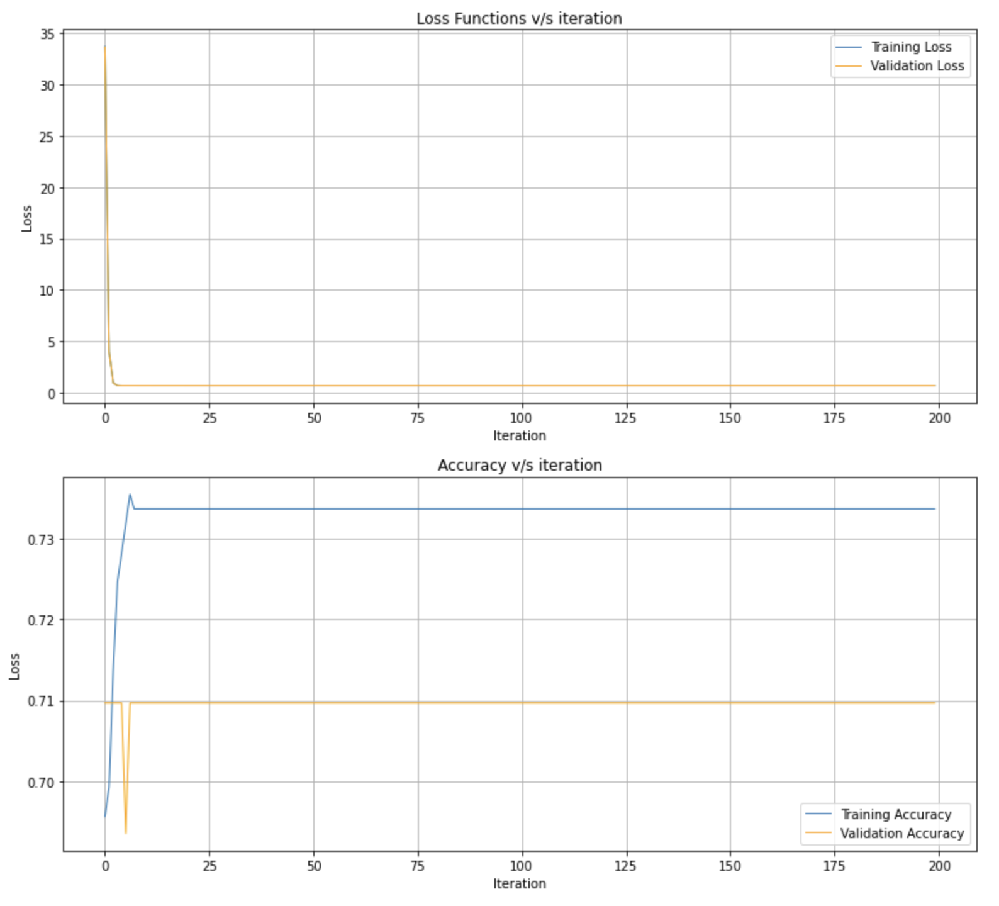
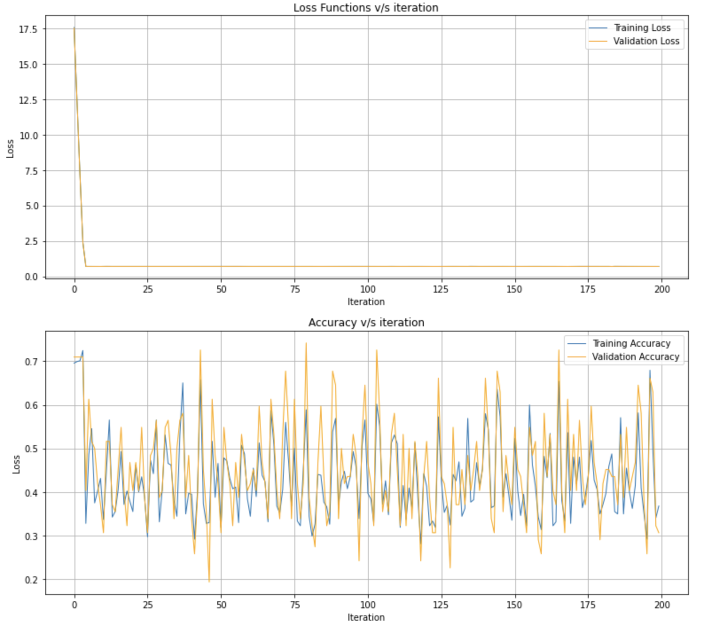
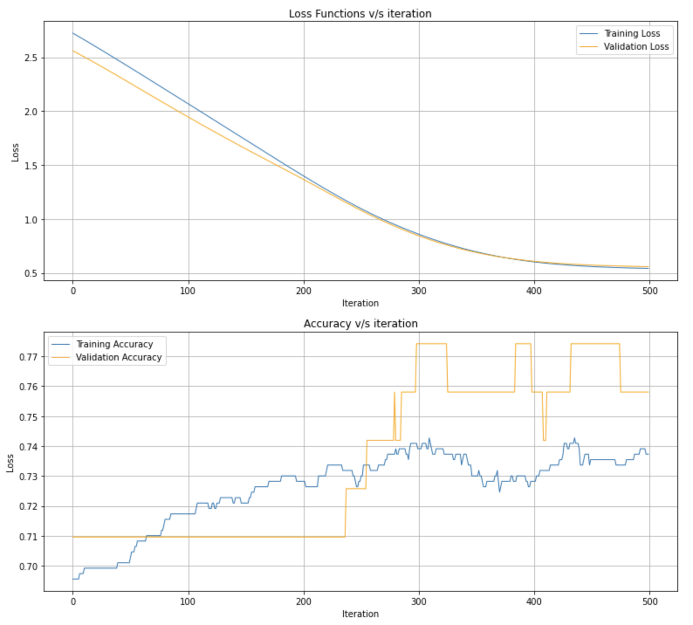
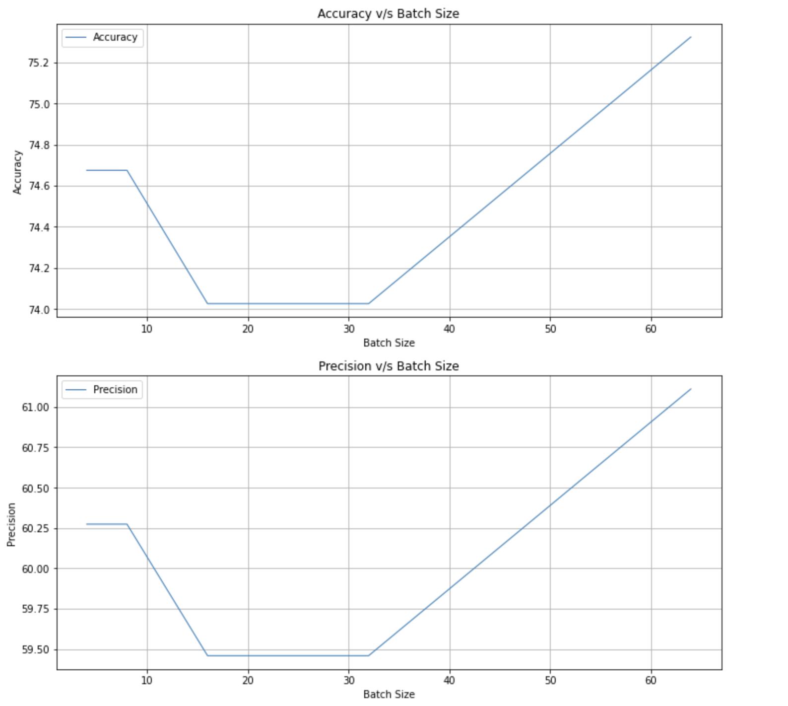
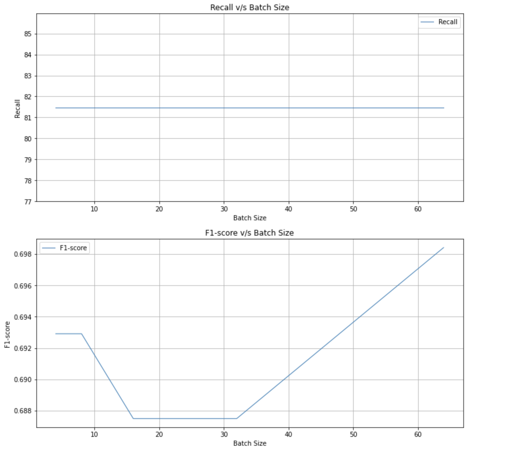

## Section A


## Section C

- The given data has 11 features - 5 of which are categorical and 6 numerical - that predict the target variable i.e. **CO2 Emissions(g/km)** for the data point in consideration.

### Scatter Plots
- The variation of the target variable is visaulized with the all the variables using scatter plots as follows:

#### Make


#### Model


#### Vehicle Class


#### Engine Size


#### Cylinders


#### Transmission


#### Fuel Type


#### Fuel Consumption City (L/100 km)


#### Fuel Consumption Hwy (L/100 km)


#### Fuel Consumption Comb (L/100 km)


#### Fuel Consumption Comb (mpg)


### Pair Plot
- The relation between all possible combinations of pairs of variables are shown by the following Pair Plots:  


### Box Plots
- The variation with respect to the target variable can also be visualized using Box Plots that are grouped by the target variable i.e. CO2 Emissions(g/km):
#### Make


#### Vehicle Class


#### Engine Size(L)


#### Cylinders


#### Transmission


#### Fuel Type


#### Fuel Consumption Comb (mpg)


### Correlation Heatmap
- The following correlation heatmap shows the correlation coefficients that indicate the level of dependency between all pairs of variables:  


### Distribution Plots
- The categorical features are visualized using distribution plots (i.e. Pie charts) as follows:
#### Make


#### Vehicle Class


#### Transmission


#### Fuel Type


### Some inferences from the Data Visualization
- As can be seen from the pair plots and the correlation heatmap, there is a very strong correlation (probably linear) between the **Fuel Consumption City** and **Fuel Consuption Highway** variables.
- There is an exponential relation between each of the fuel consumption variables with the **Fuel Consumption Comb (mpg)** variable except for itself.
- As can be seen from the pair plots and is confirmed by the correlation heatmap, the **Make, Model, Vehicle Class, Transmission**, and **Fuel Type** variables are unrelated with the target variable.
- There is a negative exponential relation between the **Fuel Consumption Comb (mpg)** variable and the target variable.
- It is beneficial to eliminate the high correlation coefficient features from the dataset (i.e. preserve only one of these) to aim for better efficiency for the model to learn the underlying pattern. Removing features such as **Fuel Consumption City (L/100 km), Fuel Consumption Hwy (L/100 km), Engine Size(L), Cylinders** could possibly lead to better performance of the model for the same reasoning.  

### TSNE Algorithm
- **t-Stochastic Neighbor Embedding** algorithm was used to reduce the dimensions of the dataset to 2 (excluding the target variable) and the resulting data plotted as a scatter plot as follows:  



- It can clearly be seen that the data is not separable since there is no visible grouping of similarly placed labels with respect to the target variable.
- For the data to be separable, the points which are closer to each other in terms of the target variable should have been placed closer together, as if forming a cluster; however, on the contrary the data is highly scattered and does not show separability.

### Pre-processing
- Regressive variables are standardized to increase the efficiency of the subsequently trained model.
- Categorical variables are encoded with dummy integers that represent each class within each categorical variable.

### Linear Regression (Raw)

- A Linear Regression model is trained on the pre-processed data and the performance of the model on the Test data is reported using metrics such as **MSE**, **RMSE**, etc
- Results are as follows:
    - **Performance on Train set**:                  
            MSE: 292.3107333654392  
            RMSE: 17.09709722044766  
            R2 score: 0.9141586281491605  
            Adjusted R2 score: 0.913998476336006  
            MAE: 11.604193652364458  

    - **Performance on Test set**:                  
            MSE: 279.37573811472396  
            RMSE: 16.714536730484753  
            R2 score: 0.9200728127273329  
            Adjusted R2 score: 0.9199236948406302  
            MAE: 11.319165859676161  

### Dimensionality Reduction

- PCA is used to reduce the dimensions of the pre-processed data to a range of values -  ```[4,6,8,10]``` - and the performance of a new trained model for each so-obtained dataset is reported with the same metrics.
- For each value of n_components in ```[4,6,8,10]``` the results are as follows:
    - Number of features taken: ```4```     
        - **Performance on Train set**:                
            MSE: 443.77787039685364  
            RMSE: 21.066035944070105  
            R2 score: 0.8696780622684654  
            Adjusted R2 score: 0.8695897533152338  
            MAE: 12.655005269699938  

        - **Performance on Test set**:                
            MSE: 460.88249256468356  
            RMSE: 21.468173945743118  
            R2 score: 0.8681451669980585  
            Adjusted R2 score: 0.8680558193219603  
            MAE: 13.260462235918263  

    

    - Number of features taken: ```6```      
        - **Performance on Train set**:                
            MSE: 371.998855912879  
            RMSE: 19.28727186288613  
            R2 score: 0.8907570319062399  
            Adjusted R2 score: 0.8906459561888085  
            MAE: 10.869360497445747  

        - **Performance on Test set**:                
            MSE: 374.617110695997  
            RMSE: 19.355028046892542  
            R2 score: 0.8928250099160404  
            Adjusted R2 score: 0.8927160368707084  
            MAE: 11.05588569502356  

    - Number of features taken: ```8```
        - **Performance on Train set**:                
            MSE: 298.73952593473905  
            RMSE: 17.28408302267549  
            R2 score: 0.9122707180914642  
            Adjusted R2 score: 0.912151742967669  
            MAE: 11.689644064287116  

        - **Performance on Test set**:                
            MSE: 289.10843467016065  
            RMSE: 17.003188955903557  
            R2 score: 0.917288365282097  
            Adjusted R2 score: 0.917176194901059  
            MAE: 11.485518223111491  

    

    - Number of features taken: ```10```      
        - **Performance on Train set**:                
            MSE: 292.370309316888  
            RMSE: 17.098839414325404  
            R2 score: 0.9141411327895382  
            Adjusted R2 score: 0.913995535253146  
            MAE: 11.60570812403026  

        - **Performance on Test set**:                
            MSE: 279.2696681342233  
            RMSE: 16.711363443304776  
            R2 score: 0.9201031585091559  
            Adjusted R2 score: 0.9199676712419169  
            MAE: 11.315581090429893  

### One-Hot Encoding

- Instead of encoding the categorical variables in-place, the data is processed to have **One-Hot Encoding**. This increases the dimensionality of the data to a much larger number as compared to what it was previously.  
- The performance of a new model trained on the one-hot encoded data is reported with the same metrics.  
- Results generated are as follows:
    - **Performance on Train set**:                
        MSE: 9.11357865443506  
        RMSE: 3.0188704269039204  
        R2 score: 0.9973236627845985  
        Adjusted R2 score: 0.9973191243121288  
        MAE: 1.930412530737627  

    - **Performance on Test set**:                
        MSE: 1.4392706133678346e+17  
        RMSE: 379377201.92017794  
        R2 score: -41176392992098.47  
        Adjusted R2 score: -41246218993441.695  
        MAE: 75710805.9037506  

- As can be seen from the results, the performance is highly poor as compared to the original model trained on the pre-processed data.

### PCA on One-Hot Encoded Data

- The one-hot encoded dataset is processed to filter out a set number of dimensions - ```[400,500,600,700,800]``` - since the dimensionality of the one-hot encoded dataset was very large for the model to identify the correlation between the independent variables and the target variable.  
- A new model is trained for each of these values of the dimensionality of the so-obtained dataset and its performance reported using the same performance metrics.  
- For each value of n_components in ```[400,500,600,700,800]``` the results are as follows:
    - Number of features taken: ```400```      
        - **Performance on Train set**:                
            MSE: 19.60370956078714  
            RMSE: 4.427607656600474  
            R2 score: 0.994243080633103  
            Adjusted R2 score: 0.9938249277827745  
            MAE: 2.7630255523142826  

        - **Performance on Test set**:                
            MSE: 19.8184596336766  
            RMSE: 4.451792856106021  
            R2 score: 0.9943300955720564  
            Adjusted R2 score: 0.9939182630368871  
            MAE: 2.9396479663745487  

    

    - Number of features taken: ```500```      
        - **Performance on Train set**:                
            MSE: 18.77729935599381  
            RMSE: 4.333278130468181  
            R2 score: 0.9944857682172167  
            Adjusted R2 score: 0.9939758522025336  
            MAE: 2.706745413766306  

        - **Performance on Test set**:                
            MSE: 19.40976752439977  
            RMSE: 4.405651770669099  
            R2 score: 0.9944470191495134  
            Adjusted R2 score: 0.9939335199031211  
            MAE: 2.9088360513734375  

    - Number of features taken: ```600```      
        - **Performance on Train set**:                
            MSE: 18.211564782227477  
            RMSE: 4.2675009996750415  
            R2 score: 0.9946519045453509  
            Adjusted R2 score: 0.9940472583661933  
            MAE: 2.666344164698163  

        - **Performance on Test set**:                
            MSE: 19.48903734154044  
            RMSE: 4.414638982016586  
            R2 score: 0.9944243406822906  
            Adjusted R2 score: 0.9937939665367045  
            MAE: 2.897366403066038  

    

    - Number of features taken: ```700```      
        - **Performance on Train set**:                
            MSE: 17.806872489051834  
            RMSE: 4.219819011409356  
            R2 score: 0.9947707484250254  
            Adjusted R2 score: 0.9940677570475562  
            MAE: 2.642438655587996  

        - **Performance on Test set**:                
            MSE: 19.36068065699483  
            RMSE: 4.400077346705945  
            R2 score: 0.9944610625137302  
            Adjusted R2 score: 0.9937164386918772  
            MAE: 2.9244496590040723  

    - Number of features taken: ```800```      
        - **Performance on Train set**:                
            MSE: 17.157355621438427  
            RMSE: 4.142143843644065  
            R2 score: 0.9949614886633816  
            Adjusted R2 score: 0.9941722172576063  
            MAE: 2.6106952118002065  

        - **Performance on Test set**:                
            MSE: 19.006185895692983  
            RMSE: 4.359608456695737  
            R2 score: 0.9945624806589313  
            Adjusted R2 score: 0.993710705551656  
            MAE: 2.8986413186448257  

- As can be seen from the results, all of these models performed much better than any of the models that have been trained before this. However, among these the best performance (or the least MSE) is observed for ```700``` dimensions.  

### Regularization

- **L1 (LASSO)** and **L2 (Ridge)** regularization are used to train new models on the original pre-processed data and their performance reported through the same metrics as earlier.  
- Results for **L1 Regularization** are as follows:

    - **Performance on Train set**:                
        MSE: 292.34659382454373  
        RMSE: 17.09814591774628  
        R2 score: 0.914148097194757  
        Adjusted R2 score: 0.9139879257342994  
        MAE: 11.591493968945871  

    - **Performance on Test set**:                
        MSE: 279.33437487428796  
        RMSE: 16.713299341371467  
        R2 score: 0.9200846464230104  
        Adjusted R2 score: 0.919935550614098  
        MAE: 11.305182281238864  
- Results for **L2 Regularization** are as follows:

    - **Performance on Train set**:                  
        MSE: 292.4150039454139  
        RMSE: 17.100146313567436  
        R2 score: 0.9141280075505747  
        Adjusted R2 score: 0.9139677986094377  
        MAE: 11.611359426827896  

    - **Performance on Test set**:                  
        MSE: 279.44791296544224  
        RMSE: 16.71669563536533  
        R2 score: 0.9200521640738433  
        Adjusted R2 score: 0.9199030076635333  
        MAE: 11.316980439055115  

- As can be seen from the results, the performance is slightly better than the originally-trained model but not so much so as to make a big difference in its performance on new, unseen data.  

### SGD Regressor

- A new model is trained using the ```SGDRegressor``` function to train a **Linear Regression** model that uses **SGD (Stochastic Gradient Descent)**.  
- Results generated using the **SGD** model are as follows:
    - **Performance on Train set**:                
        MSE: 465.91099293096624  
        RMSE: 21.58497146004521  
        R2 score: 0.8631783433570298  
        Adjusted R2 score: 0.8629230790722482  
        MAE: 16.06143064028334  

    - **Performance on Test set**:                
        MSE: 451.1535093762823  
        RMSE: 21.24037451120583  
        R2 score: 0.8709285520783787   
        Adjusted R2 score: 0.8706877471382264  
        MAE: 15.860132823454421  

- As can be seen from the performance metrics of this model, the performance is not as good as the original model trained on the raw data which uses **Batch Gradient Descent** as its gradient descent algorithm.


## Section B

### Logistic Regression
- **Logistic Regression** algorithm is implemented as a class which takes as input the **dataset**, the **train:test:validation set** split ratios, and the **activation function** to use when initialising an instance of the class.
- This implementation of Logistic Regression uses **Mini-Batch Gradient Descent**.
- When called to train the model on the chosen dataset, it takes as input the **learning rate**, the **number of iterations**, the **weights** to initialise, the **batch size** to use for Mini-BGD, and the **regularization** to use and their corresponding hyperparameters.
- For **Batch Size** = 1, the algorithm translates to **Stochastic Gradient Descent**.

### Training the Model
- An instance of the logistic regression is trained for each of the required learning rates - ```[1,0.1,0.01,0.001]``` - and the corresponding training loss, validation loss, training accuracy, and validation accuracy reported through the graphs shown below each code block.
- The best set of training and validation accuracy is seen for **Learning Rate = ```0.001```** (with Max iterations set to a constant = ```200```)
- The best performance on the test set is also seen for **Learning Rate = ```0.001```** (with Max iterations set to a constant = ```200```) with **Accuracy = ```74.025%```** and **Recall = ```81.481%```**
- The **F1 score** (= **```0.6875```)** also indicates good performance.  

  
- **Test Set Results**:
    Accuracy : 74.02597402597402
    Precision : 59.45945945945946
    Recall : 81.48148148148148
    F1 Score : 0.6875

### L1 Regularization
- A new model is trained with **L1 (LASSO) regularization** (with varied values for the **regularization parameter &lambda; ∊ ```[0.1,0.05,0.01,0.001]```**).
- The best performance on the training and validation set for models trained with **L1 regularization** was obtained for **&lambda; = ```0.01```**, followed very closely by **&lambda; = ```0.05```**.
- The best performance on the testing set was seen for **&lambda; = ```0.05```** with **Accuracy = ```70.779```** and **Recall = ```75.925```**.
- This is also validated by it achieving the highest **F1 score = ```0.645```** out of them all.  

  
- **Test Set Results for &lambda; = ```0.05```**:
    Accuracy : 70.77922077922078
    Precision : 56.16438356164384
    Recall : 75.92592592592592
    F1 Score : 0.6456692913385828

### L2 Regularization
- A new model is trained with **L2 (Ridge Regression) regularization** (with varied values for the **regularization parameter &lambda; ∊ ```[0.1,0.05,0.01,0.001]```**).
- The best performance on the training and validation set for models trained with **L2 regularization** was obtained for **&lambda; = ```0.001```**, followed very closely by **&lambda; = ```0.01```**.
- The best performance on the testing set was seen for **&lambda; = ```0.01```** with **Accuracy = ```54.545```** and **Recall = ```66.666```**.
- This is also validated by it achieving the highest **F1 score = ```0.507```** out of them all.
- It can, however, be clearly seen that model trained with **L2 regularization** performs consistently poorly as compared to **L1 regularization** or no regularization.  

  

- **Test Set Results for &lambda; = ```0.01```**
    Accuracy : 54.54545454545454
    Precision : 40.909090909090914
    Recall : 66.66666666666666
    F1 Score : 0.5070422535211268


### Hyperbolic Tangent Function
- The **sigmoid** function is replaced by the **hyperbolic tan function** i.e. **tanh(z)**.
- The loss function remains the same, since **tanh(z)** can be mapped from **```(-1,1)```** to **```(0,1)```** as **f(z) = (tanh(z) + 1)/2**.
- **Learning Rate = ```0.0001```** and **Max iterations = ```500```**
- Performance on the training and validation set is similar to the performance of the original model trained using the **sigmoid** function.
- However, the performance on the testing set with the set hyperparameters is better than the above referenced model with **Accuracy = ```75.974%```** and **Recall = ```85.185```**.
- This is also validated by a high **F1 score = ```0.713```**.  

  

- **Test Set Results**:
    Accuracy : 75.97402597402598
    Precision : 61.33333333333333
    Recall : 85.18518518518519
    F1 Score : 0.7131782945736435


### Mini-Batch Gradient Descent
- A new model is trained with batch size increased to simulate **Mini-Batch Gradient Descent**.
- The batch size is varied in the range of ```[4,8,16,32,64]``` and the corresponding results analyzed.
- The performance of **Mini-batch gradient descent** initially decreases while constantly increasing the **batch size**; however, it then increases with increase in batch size showing a somewhat **positive quadratic correlation** between the batch size and the performance of the model.
- The convergence rate of smaller batch sizes is clearly higher as compared to larger batch sizes as can be seen from the steeper curves of the loss functions for smaller batch sizes.
- Thus, **SGD converges much faster than Mini-BGD**, since **SGD** can basically be seen as **Mini-BGD** with **batch size = ```1```**.  




