## Section A

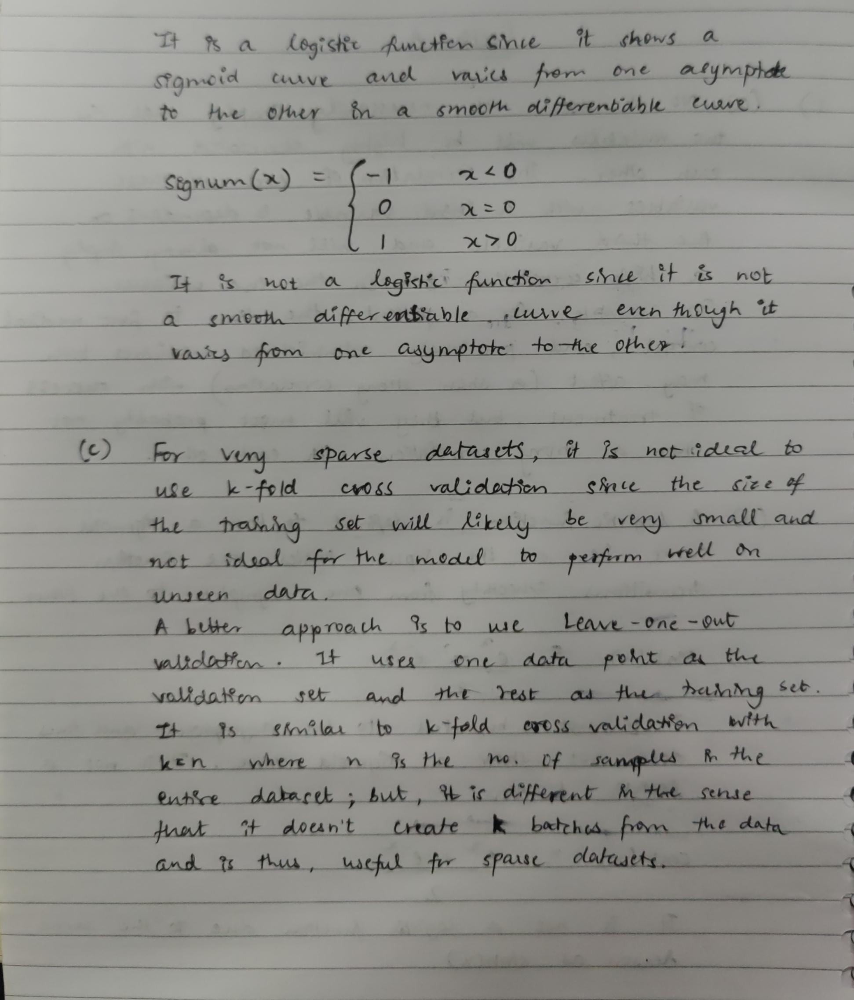
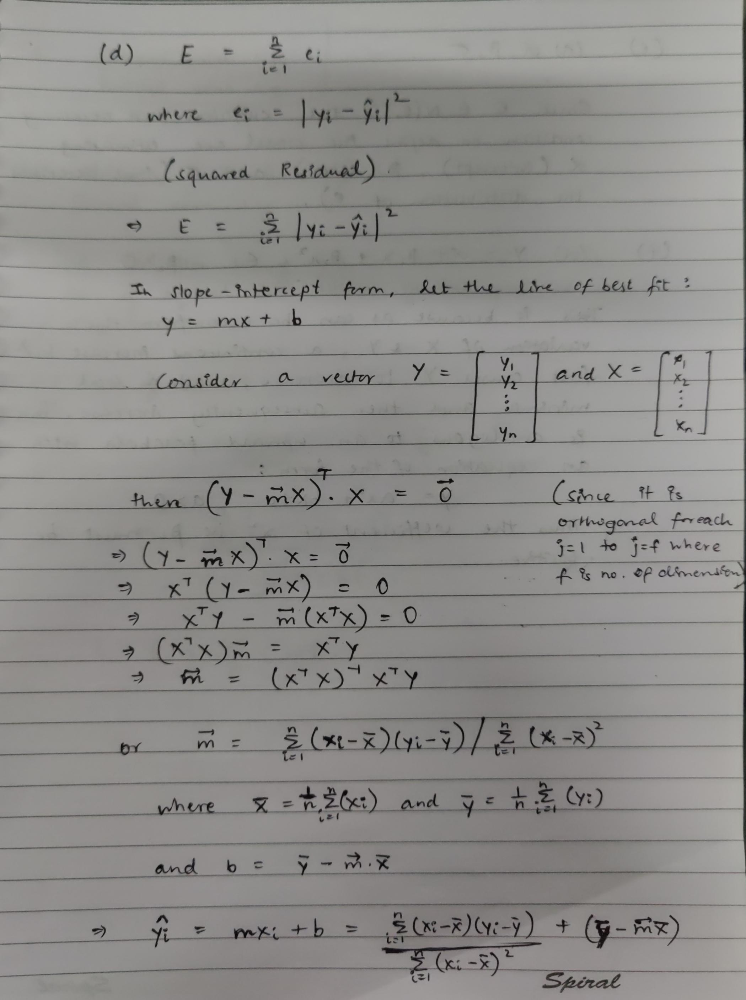
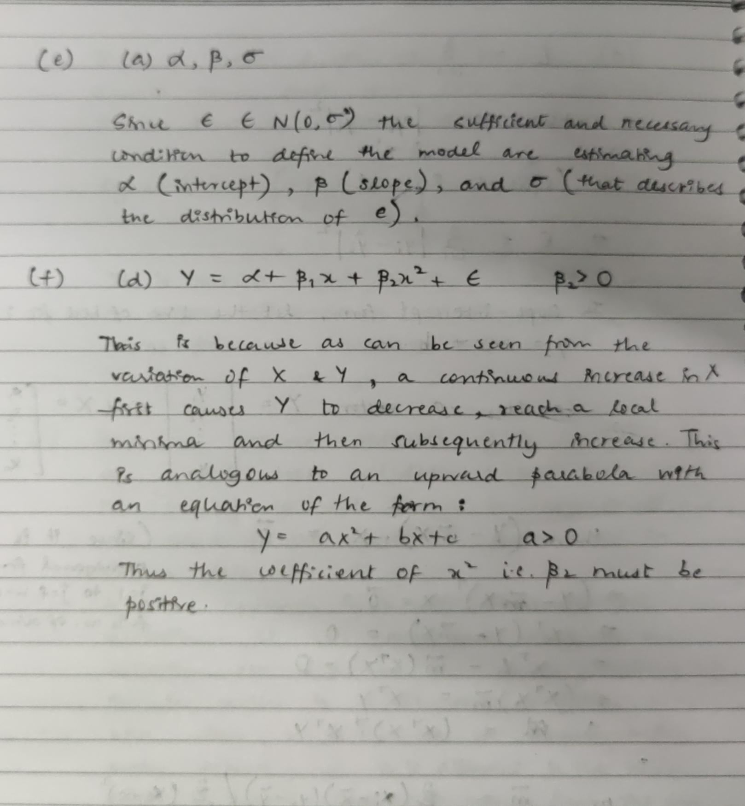

## Section C

- The given data has 11 features - 5 of which are categorical and 6 numerical - that predict the target variable i.e. **CO2 Emissions(g/km)** for the data point in consideration.
- The variation of the target variable is visaulized with the all the variables using scatter plots as follows:

#### Make
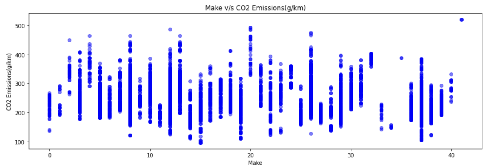

#### Model

#### Vehicle Class
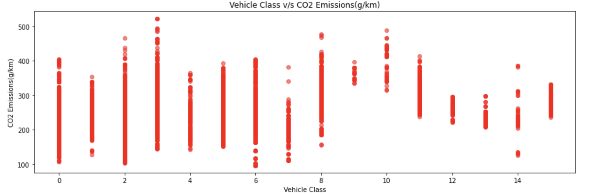

#### Engine Size
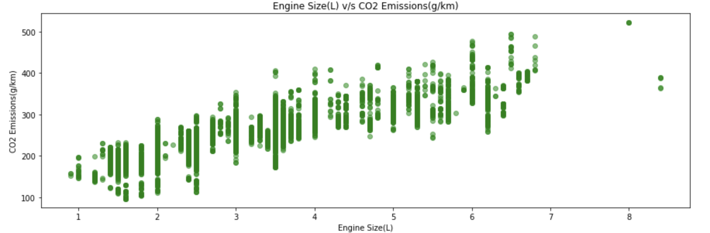

#### Cylinders
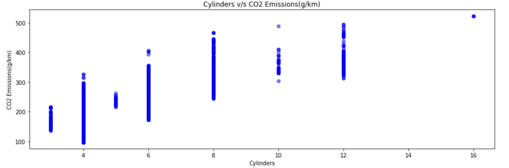

#### Transmission
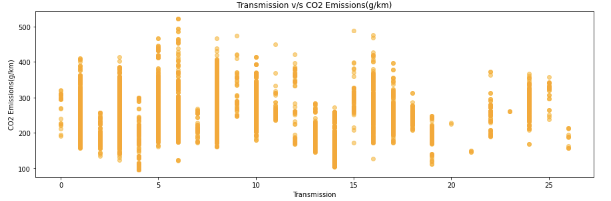

#### Fuel Type
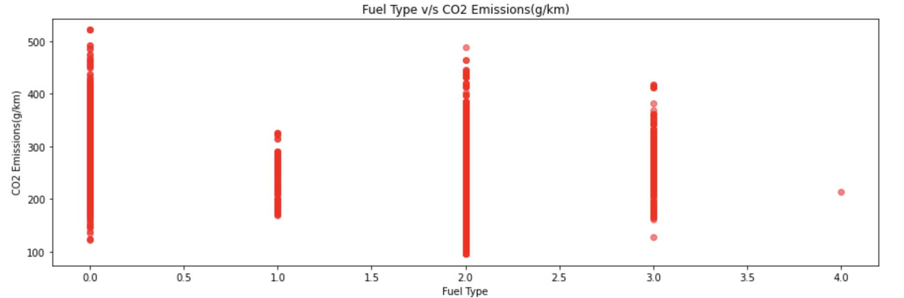

#### Fuel Consumption City (L/100 km)

#### Fuel Consumption Hwy (L/100 km)
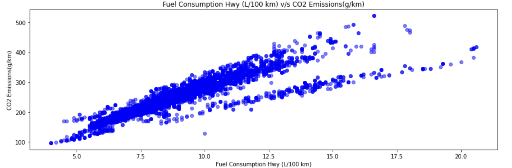

#### Fuel Consumption Comb (L/100 km)
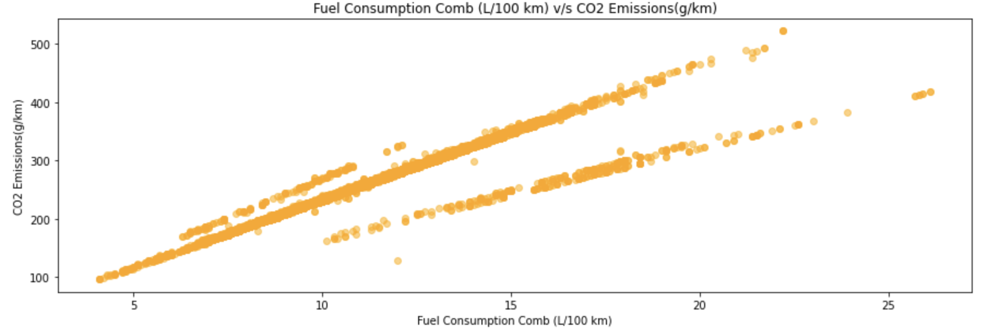

#### Fuel Consumption Comb (mpg)
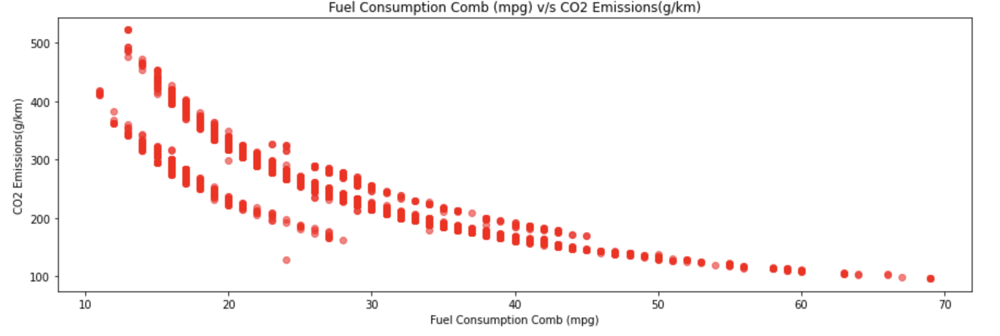

- The relation between all possible combinations of pairs of variables are shown by the following Pair Plots:  

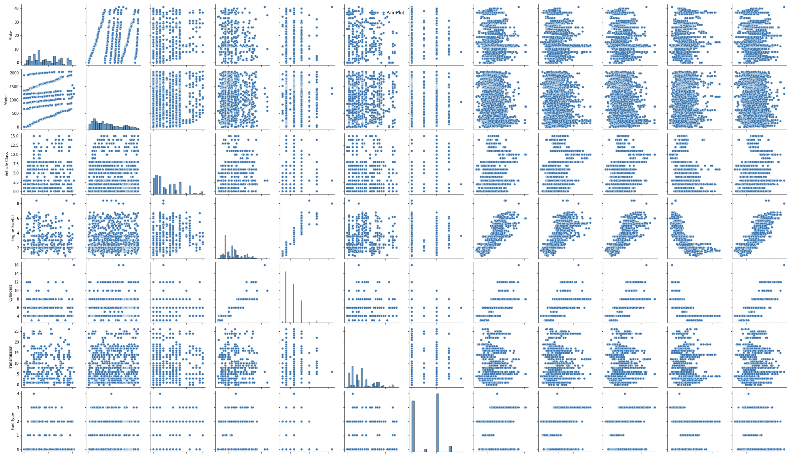
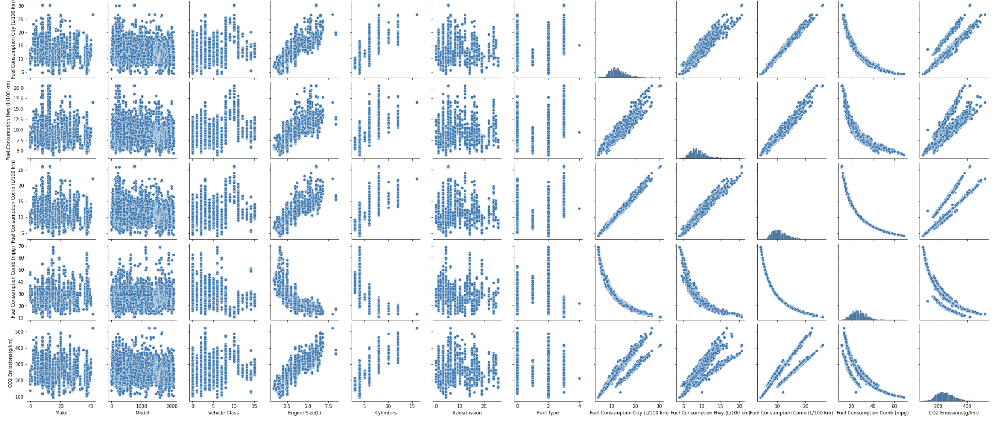

- The variation with respect to the target variable can also be visualized using Box Plots that are grouped by the target variable i.e. CO2 Emissions(g/km):
#### Make
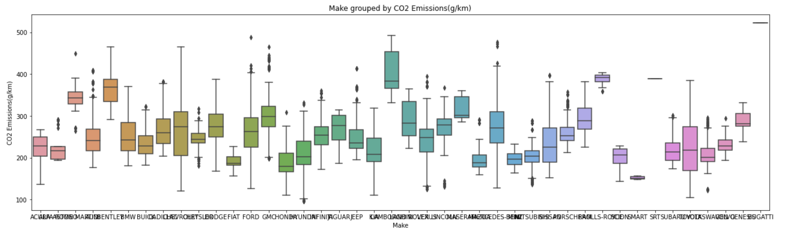

#### Vehicle Class
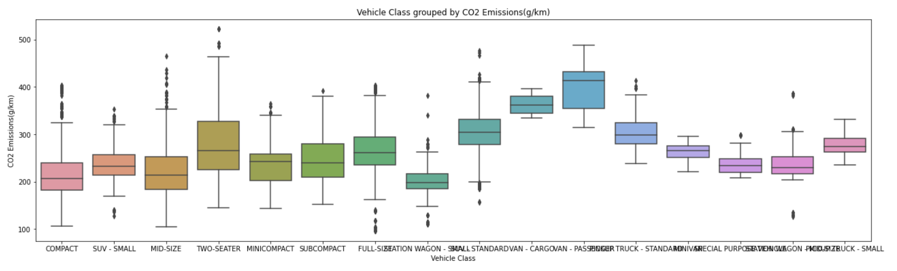

#### Engine Size(L)
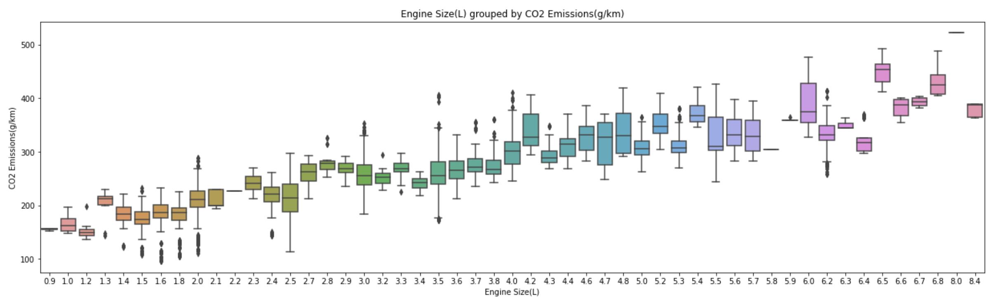

#### Cylinders
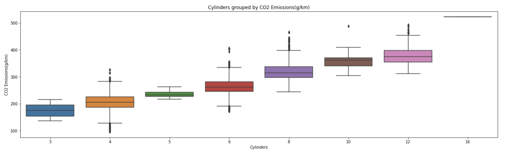

#### Transmission
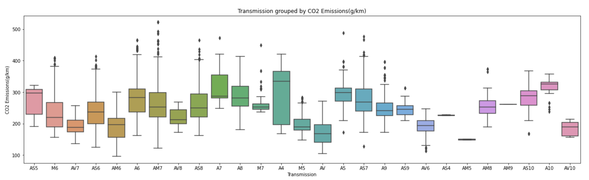

#### Fuel Type
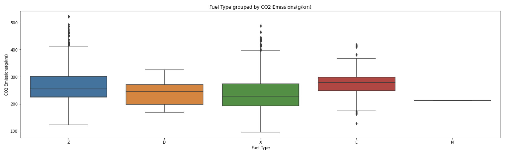

#### Fuel Consumption Comb (mpg)
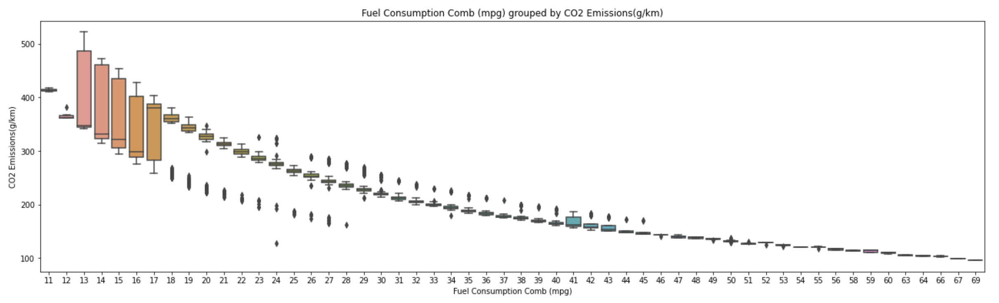

- The follwing correlation heatmap shows the correlation coefficients that indicate the level of dependency between all pairs of variables:  

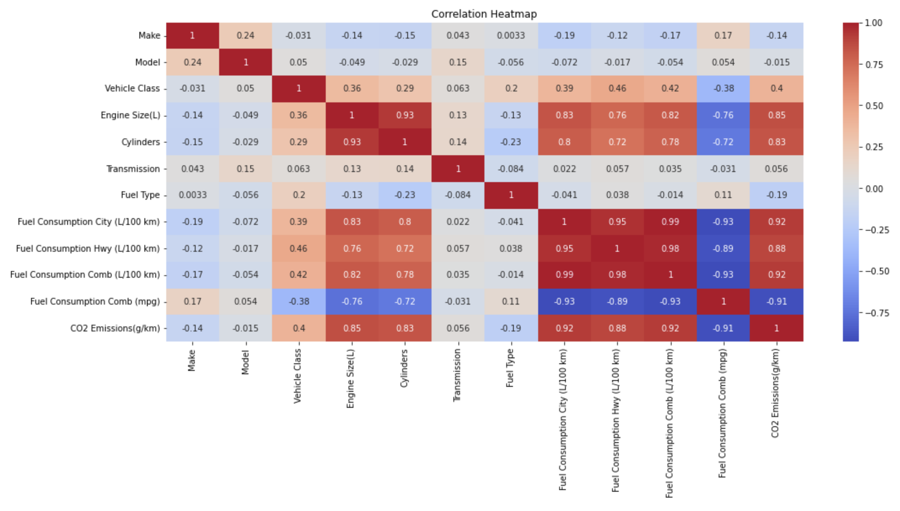

- The categorical features are visualized using distribution plots (i.e. Pie charts) as follows:
#### Make
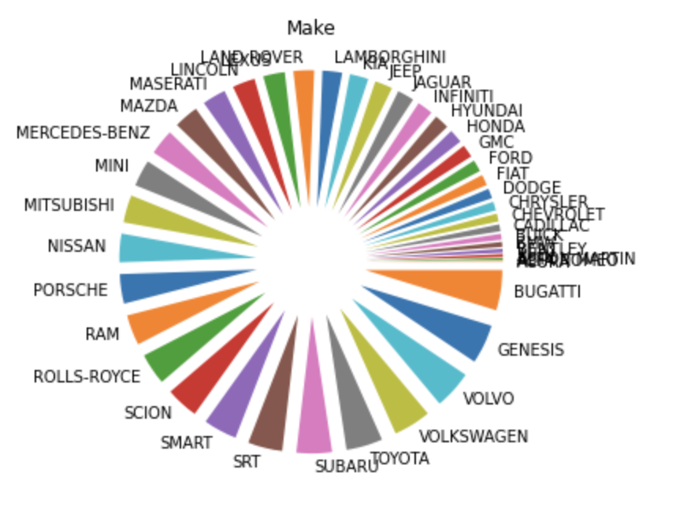

#### Vehicle Class

#### Transmission
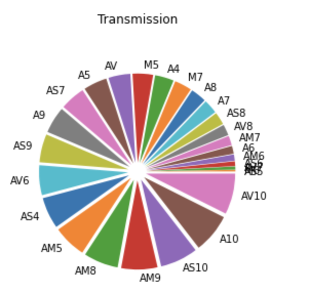

#### Fuel Type
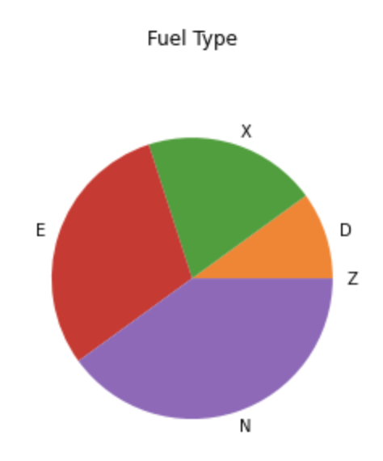

Make,Model,Vehicle Class,Engine Size(L),Cylinders,Transmission,Fuel Type,Fuel Consumption City (L/100 km),Fuel Consumption Hwy (L/100 km),Fuel Consumption Comb (L/100 km),Fuel Consumption Comb (mpg)