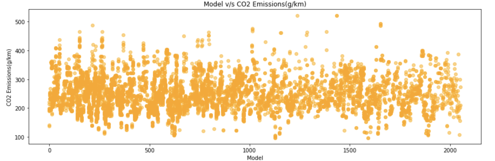

## Section A

## Section C

- The given data has 11 features - 5 of which are categorical and 6 numerical - that predict the target variable i.e. **CO2 Emissions(g/km)** for the data point in consideration.
- The variation of the target variable is visaulized with the all the variables using scatter plots as follows:

#### Make

#### Model

#### Vehicle Class

#### Engine Size

#### Cylinders

#### Transmission

#### Fuel Type

#### Fuel Consumption City (L/100 km)

#### Fuel Consumption Hwy (L/100 km)

#### Fuel Consumption Comb (L/100 km)

#### Fuel Consumption Comb (mpg)
