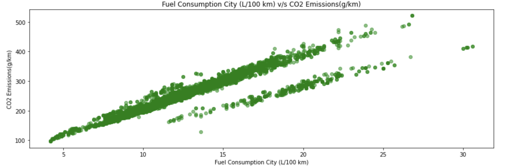

## Section A

## Section C

- The given data has 11 features - 5 of which are categorical and 6 numerical - that predict the target variable i.e. **CO2 Emissions(g/km)** for the data point in consideration.

### Scatter Plots
- The variation of the target variable is visaulized with the all the variables using scatter plots as follows:

#### Make

#### Model

#### Vehicle Class

#### Engine Size

#### Cylinders

#### Transmission

#### Fuel Type

#### Fuel Consumption City (L/100 km)

#### Fuel Consumption Hwy (L/100 km)

#### Fuel Consumption Comb (L/100 km)

#### Fuel Consumption Comb (mpg)

### Pair Plot
- The relation between all possible combinations of pairs of variables are shown by the following Pair Plots:  

### Box Plots
- The variation with respect to the target variable can also be visualized using Box Plots that are grouped by the target variable i.e. CO2 Emissions(g/km):
#### Make

#### Vehicle Class

#### Engine Size(L)

#### Cylinders

#### Transmission

#### Fuel Type

#### Fuel Consumption Comb (mpg)

### Correlation Heatmap
- The follwing correlation heatmap shows the correlation coefficients that indicate the level of dependency between all pairs of variables:  

### Distribution Plots
- The categorical features are visualized using distribution plots (i.e. Pie charts) as follows:
#### Make

#### Vehicle Class

#### Transmission

#### Fuel Type

### Some inferences from the Data Visualization
- As can be seen from the pair plots and the correlation heatmap, there is a very strong correlation (probably linear) between the **Fuel Consumption City** and **Fuel Consuption Highway** variables.
- There is an exponential relation between each of the fuel consumption variables with the **Fuel Consumption Comb (mpg)** variable except for itself.
- As can be seen from the pair plots and is confirmed by the correlation heatmap, the **Make, Model, Vehicle Class, Transmission**, and **Fuel Type** variables are unrelated with the target variable.
- There is a negative exponential relation between the **Fuel Consumption Comb (mpg)** variable and the target variable.
- It is beneficial to eliminate the high correlation coefficient features from the dataset (i.e. preserve only one of these) to aim for better efficiency for the model to learn the underlying pattern. Removing features such as **Fuel Consumption City (L/100 km), Fuel Consumption Hwy (L/100 km), Engine Size(L), Cylinders** could possibly lead to better performance of the model for the same reasoning.  

### TSNE Algorithm
- **t-Stochastic Neighbor Embedding** algorithm was used to reduce the dimensions of the dataset to 2 (excluding the target variable) and the resulting data plotted as a scatter plot as follows:  

- It can clearly be seen that the data is not separable since there is no visible grouping of similarly placed labels with respect to the target variable.
- For the data to be separable, the points which are closer to each other in terms of the target variable should have been placed closer together, as if forming a cluster; however, on the contrary the data is highly scattered and does not show separability.

### Pre-processing
- Regressive variables are standardized to increase the efficiency of the subsequently trained model.
- Categorical variables are encoded with dummy integers that represent each class within each categorical variable.

### Linear Regression (Raw)

- A Linear Regression model is trained on the pre-processed data and the performance of the model on the Test data is reported using metrics such as **MSE**, **RMSE**, etc
- Results are as follows:
    - Performance on Train set:  
        MSE: 292.3107333654392  
        RMSE: 17.09709722044766  
        R2 score: 0.9141586281491605  
        Adjusted R2 score: 0.913998476336006  
        MAE: 11.604193652364458  

    - Performance on Test set:  
        MSE: 279.37573811472396  
        RMSE: 16.714536730484753  
        R2 score: 0.9200728127273329  
        Adjusted R2 score: 0.9199236948406302  
        MAE: 11.319165859676161  

<!-- Make,Model,Vehicle Class,Engine Size(L),Cylinders,Transmission,Fuel Type,Fuel Consumption City (L/100 km),Fuel Consumption Hwy (L/100 km),Fuel Consumption Comb (L/100 km),Fuel Consumption Comb (mpg) -->