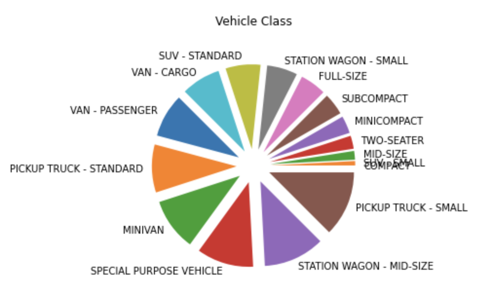

## Section A

## Section C

- The given data has 11 features - 5 of which are categorical and 6 numerical - that predict the target variable i.e. **CO2 Emissions(g/km)** for the data point in consideration.
- The variation of the target variable is visaulized with the all the variables using scatter plots as follows:

#### Make

#### Model

#### Vehicle Class

#### Engine Size

#### Cylinders

#### Transmission

#### Fuel Type

#### Fuel Consumption City (L/100 km)

#### Fuel Consumption Hwy (L/100 km)

#### Fuel Consumption Comb (L/100 km)

#### Fuel Consumption Comb (mpg)

- The relation between all possible combinations of pairs of variables are shown by the following Pair Plots:  

- The variation with respect to the target variable can also be visualized using Box Plots that are grouped by the target variable i.e. CO2 Emissions(g/km):
#### Make

#### Vehicle Class

#### Engine Size(L)

#### Cylinders

#### Transmission

#### Fuel Type

#### Fuel Consumption Comb (mpg)

- The follwing correlation heatmap shows the correlation coefficients that indicate the level of dependency between all pairs of variables:  

- The categorical features are visualized using distribution plots (i.e. Pie charts) as follows:
#### Make

#### Vehicle Class

#### Transmission

#### Fuel Type

Make,Model,Vehicle Class,Engine Size(L),Cylinders,Transmission,Fuel Type,Fuel Consumption City (L/100 km),Fuel Consumption Hwy (L/100 km),Fuel Consumption Comb (L/100 km),Fuel Consumption Comb (mpg)